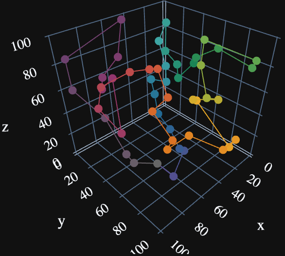

# Simulated-Annealing

Simple and Clean Interface to perform Simulated Annealing on
NP Hard Problems.


### Table of Contents
- [Simulated-Annealing](#simulated-annealing)
    - [Table of Contents](#table-of-contents)
    - [Installation](#installation)
    - [Temperature Cooling Paradigms](#temperature-cooling-paradigms)
    - [Examples](#examples)
      - [_Traveling Salesman Problem (TSP)_](#traveling-salesman-problem-tsp)
    - [License](#license)


### Installation
```bash
pip install git+https://github.com/Spill-Tea/Simulated-Annealing@main
```

### Temperature Cooling Paradigms

Below, we have an image of all cooling paradigms available in the package, over 1000 steps and alpha = 0.85, in a temperature range of 0 to 100. Linear cooling is not truly useful in practice, but is helpful to compare between more relevant cooling methods.


### Examples
#### _Traveling Salesman Problem (TSP)_
```python
import numpy as np
from Annealing import anneal
from Annealing import cooling
from Annealing import fitness

# Define Interface for TSP
class TSP(anneal.AnnealingBase):
    def mixing(self, index, nshuffle):
        super().mixing(index, nshuffle)

    def subsample(self, indices: np.ndarray) -> np.ndarray:
        return super().subsample(indices)

# Random XYZ Coordinates
seed = np.random.default_rng(23)
coordinates = seed.uniform(0., 100., (50, 3))

# Instantiate TSP Interface
tsp = TSP(
    tsp,
    cooling.InverseCooling(1000, 0.9),
    fitness.CircularEuclidean()
)
intial = tsp.fitness(tsp)  # 3571.1151820333043
print(f"Initial Distance: {initial}")

# You might want to simualte several times
result = travel.simulate(nswaps=2)
best = min(tsp.history, key=lambda x: x.perf)

# Best Observed Performance: 1141.554300548556
# Result will likely be larger than this on a single iteration
print(f"Proposed Minimum Distance: {best.perf}")

```



### License

